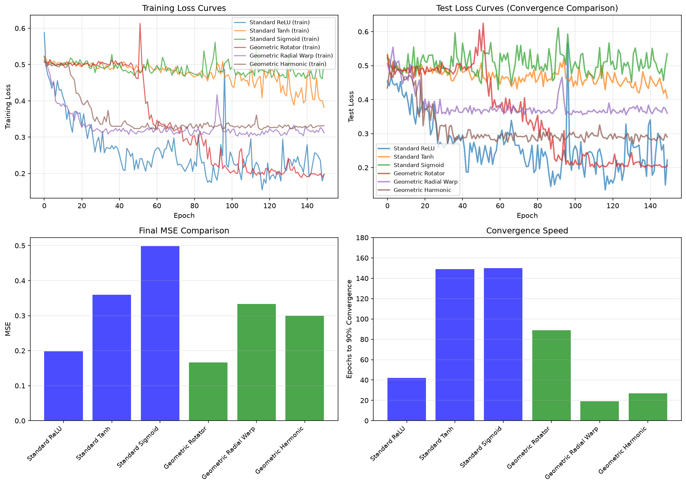
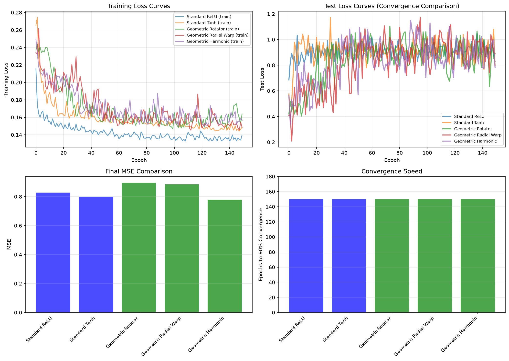
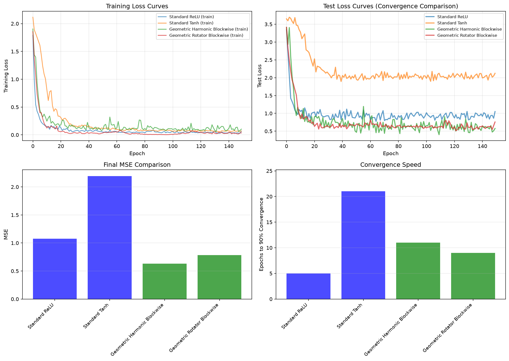
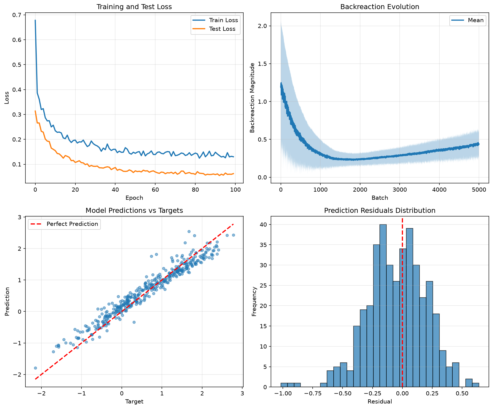

# Geometric Activation Framework (GAF)

GAF is a research-oriented PyTorch framework for replacing static nonlinearities with geometry-aware activation structure. The project was developed in the context of studying how a learned or structured geometric transformation can serve as a more principled alternative to fixed pointwise activations such as ReLU, Tanh, or Sigmoid.

## Research motivation

The central question is whether nonlinear processing can be expressed not merely as an elementwise activation, but as a coordinate-aware geometric transformation operating on the signal manifold itself. In this view, the activation is not just a fixed scalar map, but a structured deformation of the representation space. GAF implements this by converting activations into a spherical-coordinate representation, applying an operator, and then projecting back to the original space.

This makes it useful for exploring a broader design question in modern deep learning:

- when should activation be static and local?
- when is a geometric, global, or structured transformation more effective?
- how does the induced backreaction reflect the stability and expressivity of the representation?

## What the framework provides

GAF includes:

- geometric activation layers that operate in spherical coordinates
- trainable and fixed geometric operators
- backreaction metrics to quantify geometric drift or deformation
- model-level utilities for comparing geometric and standard activations
- a small experimental pipeline for benchmark-style research comparisons

## Repository structure

- `activations/` — geometric activation layers and blockwise variants
- `geometry/` — coordinate conversion and geometric metrics
- `operators/` — spherical operators such as rotation, radial warping, and harmonic perturbation
- `models/` — model definitions such as `GeometricMLP`
- `propagations/` — backreaction logging, monitoring, and loss formulations
- `tests/` — validation and comparative experiments
- `examples/` — training script and generated visualizations

## Core ideas

### Geometric activation

A geometric activation layer performs:

1. Cartesian-to-spherical coordinate conversion
2. application of a structured operator on the spherical representation
3. conversion back to Cartesian space
4. computation of a backreaction signal compared to the original geometry

This allows the framework to treat activation as a structured transformation rather than a purely static pointwise nonlinearity.

### Backreaction

Backreaction measures the extent to which a transformation modifies the original representation. The framework supports several modes for this purpose:

- `vector`: componentwise residual between original and transformed points
- `norm`: magnitude of that residual
- `energy`: squared-difference energy metric
- `divergence`: geometric divergence-style diagnostic

This makes it possible to monitor how much a learned geometric operator is actually changing the latent geometry during optimization.

## Quick example

```python
import torch
from models.geometric_mlp import GeometricMLP
from operators.harmonic_perturb import HarmonicPerturbOperator

operator = HarmonicPerturbOperator(
    max_degree=2,
    amplitude=0.1,
    trainable=True,
)

model = GeometricMLP(
    input_dim=10,
    hidden_dims=[64, 32, 16],
    output_dim=1,
    geometric_operator=operator,
    backreaction_mode='norm',
    num_geometric_layers=2,
    track_backreaction=True,
)

x = torch.randn(32, 10)
y_pred, backreaction = model(x, return_backreaction=True)
print(y_pred.shape)
```

## Benchmark experiments in the repository

The repository includes benchmark-style plots in `tests/` that are useful for evaluating whether a geometric activation framework can compete with or improve upon standard static nonlinearities across distinct function classes.

These tests are not generic visual smoke tests; they are designed to probe specific representational regimes:

- `Task 1: Sine Regression` — a one-dimensional regression problem in which the model must approximate a smooth periodic target $y = \sin(2\pi x) + \epsilon$. The comparison asks whether geometrically structured activations fit oscillatory structure more effectively than standard fixed activations such as ReLU, Tanh, or Sigmoid.

- `Task 2: Spiral Classification` — a two-dimensional binary classification problem with intertwined spiral geometry. The comparison evaluates whether geometric operators help preserve or exploit manifold structure when data are organized along curved, nonlinearly separable trajectories rather than in a simple Euclidean partition.

- `Task 3: High-Dimensional Polynomial Regression` — a 20-dimensional nonlinear regression problem with mixed polynomial and trigonometric terms. This tests whether the framework can still generalize when the target depends on interactions and higher-order structure across multiple dimensions, and whether geometric activations offer an advantage over static nonlinearities in a more challenging regime.

The plots compare standard activations against geometric alternatives in terms of convergence behavior and final predictive quality. In each case, the intended signal is not merely lower loss, but evidence that a structured, geometry-aware activation can offer a better inductive bias for the task at hand.

## Test plots

### Task 1: Sine regression

This experiment compares standard MLPs with ReLU, Tanh, and Sigmoid activations against geometric variants built from rotation, radial warping, and harmonic perturbation operators. The plot is intended to show how fast and how accurately each model converges to a smooth oscillatory target, and whether the geometric activation reduces approximation error more effectively than fixed nonlinearities.



### Task 2: Spiral classification

This experiment compares standard activations to geometric operators on a nonlinearly separable two-dimensional spiral dataset. The expected outcome is that geometric activations may better preserve the topology of the data manifold and offer more favorable optimization dynamics, particularly when the classification boundary is strongly curved.



### Task 3: High-dimensional polynomial regression

This experiment compares standard activations and geometric operators on a higher-dimensional nonlinear regression task with mixed multiplicative and trigonometric dependencies. The intended takeaway is whether the geometric framework remains competitive under a more demanding regime where static pointwise nonlinearities may struggle to capture cross-feature structure without additional architectural complexity.



## Example training

The script in `examples/training.py` demonstrates a full training pipeline using synthetic data, a geometric MLP, a backreaction-aware loss, and plot generation.

```bash
python examples/training.py
```

This example generates:

- `training_results.png`
- `geometric_model.pth`

### Training diagnostics



## Testing

Run the project test suite with:

```bash
pytest tests/
```

The tests cover:

- backreaction metric correctness and numerical stability
- spherical-coordinate conversions
- operator behavior and geometry preservation
- comparative model performance across regression and classification tasks

## Installation

```bash
git clone https://github.com/95pts659rn-ui/GAF.git
cd GAF
pip install torch numpy matplotlib pytest
```

## Requirements

- Python 3.9+
- PyTorch
- NumPy
- Matplotlib
- pytest

## Research framing

GAF is useful as a prototype for exploring whether neural representation learning can benefit from a more explicit geometric treatment of nonlinearity. Rather than assuming activations are purely local scalar transforms, the framework asks whether a learned or structured transformation can better respect the geometry of the latent space. In that sense, the repository is best read as an experimental platform for studying alternatives to static nonlinearities in research settings.

The goal is not simply to outperform a standard activation on one benchmark, but to characterize when geometric structure offers a meaningful inductive bias and when it becomes redundant or harmful.
